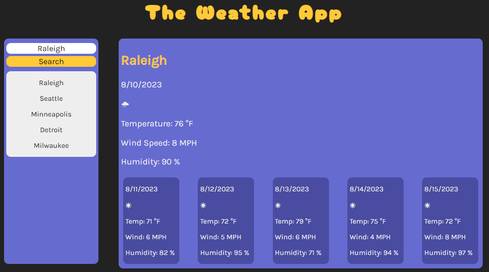

# weather-app

## Description

This project is a weather application using the OpenWeather API to display weather for today and the upcoming five day forecast.  It will also locally store your recent search history under the search bar.  This project was my first time using API's.

## Installation

Run the index.html file in a browser window or go to the github pages link here: <a href="https://max24p7.github.io/weather-app/">Weather App</a>

## Usage

Using the weather app is easy.  Simply enter in the city that you would like the upcoming forecast for and the API will pull weather data for that location for today and the next five days.  It will also display wind speed and humidity.  As you search for different cities, recent searches will be stored locally and displayed underneath the search bar.

## Resources and Credits

https://coding-boot-camp.github.io/full-stack/apis/how-to-use-api-keys

https://developer.mozilla.org/en-US/docs/Web/JavaScript/Reference/Global_Objects/Promise/then

https://www.youtube.com/watch?v=WZNG8UomjSI

https://openweathermap.org/current#name

https://www.htmlsymbols.xyz/miscellaneous-symbols/weather-symbols

https://webaim.org/resources/contrastchecker/